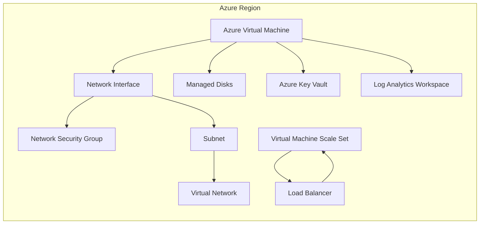
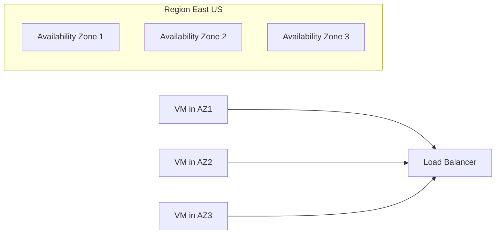

# Azure App Service

> 🤖 **Documentation générée automatiquement**  
> 📅 **Date**: 2 décembre 2025 à 17:12  
> 🏷️ **Catégorie**: Compute  
> 📦 **Azure Subscription**: `07436a2e...`  
> 🎯 **Demande originale**: "Azure App Service"  
> 📊 **Instances actives**: 1  
> 🔗 **API Path**: `Microsoft.Web/sites`

---

```markdown
---
title: "Azure Virtual Machines (VM) - Documentation Technique Entreprise"
author: "Azure Solutions Architect Expert"
date: "2024-06-01"
tags:
  - Azure
  - Compute
  - Virtual Machines
  - Infrastructure-as-Code
  - Security
  - Monitoring
  - High Availability
  - Cost Optimization
---

# 🎯 Vue d'ensemble

Azure Virtual Machines (VM) sont des ressources de calcul flexibles et évolutives qui permettent aux entreprises de déployer et gérer des machines virtuelles dans le cloud Azure. Elles offrent un environnement complet pour exécuter des applications, héberger des bases de données, ou servir de plateformes pour des workloads variés, allant des environnements de développement aux applications critiques en production.

Les cas d’usage en entreprise incluent notamment le déploiement d’applications métier, la migration de serveurs on-premises vers le cloud, la mise en place d’environnements de test et de développement, ainsi que le support de solutions Big Data et IA nécessitant une puissance de calcul importante. Azure VM supporte une large gamme de systèmes d’exploitation, y compris Windows Server, Linux, et offre une intégration native avec d’autres services Azure pour une gestion simplifiée.

Les avantages majeurs d’Azure VM comprennent la possibilité de scaler rapidement selon les besoins, la diversité des tailles et configurations disponibles, ainsi que la sécurité intégrée avec Azure Security Center et Azure Defender. Toutefois, certaines limitations existent, telles que la gestion de la maintenance des OS invités et la nécessité d’optimiser la configuration pour éviter des coûts excessifs.

# 🏗️ Architecture



## Composants principaux

- **Azure Virtual Machine** : Instance de machine virtuelle avec OS, CPU, RAM, et stockage.
- **Managed Disks** : Disques SSD ou HDD attachés aux VM pour stockage persistant.
- **Network Interface (NIC)** : Interface réseau connectant la VM au réseau virtuel.
- **Network Security Group (NSG)** : Filtrage du trafic réseau entrant et sortant.
- **Virtual Network (VNet)** : Réseau privé isolé pour les ressources Azure.
- **Load Balancer** : Répartition de charge entre plusieurs VM pour haute disponibilité.
- **Virtual Machine Scale Sets (VMSS)** : Groupes de VM identiques pour scalabilité automatique.
- **Azure Key Vault** : Gestion sécurisée des secrets, clés et certificats.
- **Log Analytics Workspace** : Collecte et analyse des logs et métriques.

## Intégrations Azure

Azure VM s’intègre nativement avec :

- **Azure Monitor** pour la surveillance avancée.
- **Azure Policy** pour la gouvernance et conformité.
- **Azure Security Center / Defender** pour la sécurité proactive.
- **Azure Automation** pour la gestion des configurations et patching.
- **Azure Backup** pour la protection des données.

# 🚀 Déploiement

## Azure CLI (bash)

```bash
# Variables
RESOURCE_GROUP="rg-prod-vm"
LOCATION="eastus"
VM_NAME="vm-prod-01"
VM_SIZE="Standard_DS3_v2"
ADMIN_USERNAME="azureuser"
IMAGE="UbuntuLTS"

# Créer un groupe de ressources
az group create --name $RESOURCE_GROUP --location $LOCATION

# Créer une VM
az vm create \
  --resource-group $RESOURCE_GROUP \
  --name $VM_NAME \
  --image $IMAGE \
  --size $VM_SIZE \
  --admin-username $ADMIN_USERNAME \
  --generate-ssh-keys \
  --public-ip-address ""

# Ajouter une règle NSG pour SSH
az vm open-port --port 22 --resource-group $RESOURCE_GROUP --name $VM_NAME
```

## Terraform (production-ready)

```hcl
provider "azurerm" {
  features {}
}

resource "azurerm_resource_group" "rg" {
  name     = "rg-prod-vm"
  location = "eastus"
}

resource "azurerm_virtual_network" "vnet" {
  name                = "vnet-prod"
  address_space       = ["10.0.0.0/16"]
  location            = azurerm_resource_group.rg.location
  resource_group_name = azurerm_resource_group.rg.name
}

resource "azurerm_subnet" "subnet" {
  name                 = "subnet-prod"
  resource_group_name  = azurerm_resource_group.rg.name
  virtual_network_name = azurerm_virtual_network.vnet.name
  address_prefixes     = ["10.0.1.0/24"]
}

resource "azurerm_network_security_group" "nsg" {
  name                = "nsg-prod"
  location            = azurerm_resource_group.rg.location
  resource_group_name = azurerm_resource_group.rg.name

  security_rule {
    name                       = "SSH"
    priority                   = 1001
    direction                  = "Inbound"
    access                     = "Allow"
    protocol                   = "Tcp"
    source_port_range          = "*"
    destination_port_range     = "22"
    source_address_prefix      = "*"
    destination_address_prefix = "*"
  }
}

resource "azurerm_network_interface" "nic" {
  name                = "nic-prod-vm"
  location            = azurerm_resource_group.rg.location
  resource_group_name = azurerm_resource_group.rg.name

  ip_configuration {
    name                          = "internal"
    subnet_id                     = azurerm_subnet.subnet.id
    private_ip_address_allocation = "Dynamic"
  }

  network_security_group_id = azurerm_network_security_group.nsg.id
}

resource "azurerm_linux_virtual_machine" "vm" {
  name                = "vm-prod-01"
  resource_group_name = azurerm_resource_group.rg.name
  location            = azurerm_resource_group.rg.location
  size                = "Standard_DS3_v2"
  admin_username      = "azureuser"
  network_interface_ids = [
    azurerm_network_interface.nic.id,
  ]

  admin_ssh_key {
    username   = "azureuser"
    public_key = file("~/.ssh/id_rsa.pub")
  }

  os_disk {
    caching              = "ReadWrite"
    storage_account_type = "Premium_LRS"
  }

  source_image_reference {
    publisher = "Canonical"
    offer     = "UbuntuServer"
    sku       = "18.04-LTS"
    version   = "latest"
  }
}
```

## PowerShell

```powershell
# Variables
$resourceGroup = "rg-prod-vm"
$location = "eastus"
$vmName = "vm-prod-01"
$vmSize = "Standard_DS3_v2"
$adminUser = "azureuser"

# Créer un groupe de ressources
New-AzResourceGroup -Name $resourceGroup -Location $location

# Créer une configuration de VM
$cred = Get-Credential -UserName $adminUser -Message "Enter password"

$vmConfig = New-AzVMConfig -VMName $vmName -VMSize $vmSize |
  Set-AzVMOperatingSystem -Linux -ComputerName $vmName -Credential $cred -DisablePasswordAuthentication $false |
  Set-AzVMSourceImage -PublisherName "Canonical" -Offer "UbuntuServer" -Skus "18.04-LTS" -Version "latest" |
  Add-AzVMNetworkInterface -Id (New-AzNetworkInterface -Name "$vmName-nic" -ResourceGroupName $resourceGroup -Location $location -SubnetId (Get-AzVirtualNetworkSubnetConfig -Name "default" -VirtualNetwork (Get-AzVirtualNetwork -Name "vnet-prod" -ResourceGroupName $resourceGroup)).Id).Id

# Déployer la VM
New-AzVM -ResourceGroupName $resourceGroup -Location $location -VM $vmConfig
```

# ⚙️ Configuration

| SKU / Tier           | vCPU | RAM (GiB) | Storage Type      | Use Case                       |
|---------------------|-------|-----------|-------------------|-------------------------------|
| Standard_B1s         | 1     | 1         | Standard HDD      | Dev/Test, Low traffic apps     |
| Standard_DS3_v2      | 4     | 14        | Premium SSD      | Production workloads           |
| Standard_E8s_v3      | 8     | 64        | Premium SSD      | Memory intensive applications  |
| Standard_F16s_v2     | 16    | 32        | Premium SSD      | Compute intensive workloads    |

## Paramètres réseau

- **Adresse IP** : Privée (statique/dynamique), optionnelle publique.
- **NSG** : Contrôle d’accès au niveau subnet/VM.
- **DNS** : Azure DNS ou personnalisé.
- **Load Balancer** : Pour répartition de charge.

## RBAC et Managed Identity

- **RBAC** : Attribution de rôles précis (ex: Virtual Machine Contributor, Reader).
- **Managed Identity** : Permet à la VM d’accéder à d’autres ressources Azure sans gérer de secrets.

# 🔒 Sécurité

## Isolation réseau

- Utilisation de **NSG** pour filtrer le trafic.
- Déploiement dans des **subnets privés**.
- Application de **Azure Firewall** ou **Azure Bastion** pour accès sécurisé.

## Chiffrement

- **Disk Encryption** avec Azure Disk Encryption (ADE) pour OS et data disks.
- **Encryption at rest** activée par défaut sur les Managed Disks.
- **Encryption in transit** via TLS pour communications réseau.

## Azure Key Vault

- Stockage sécurisé des clés, secrets et certificats.
- Intégration avec Managed Identity pour accès sécurisé depuis VM.

## Azure Policy

- Application de politiques pour forcer chiffrement, types SKU, restrictions réseau.
- Exemples : Interdire VM sans chiffrement, forcer utilisation de Managed Identity.

# 📊 Monitoring

| Métrique           | Warning Threshold | Critical Threshold | Action recommandée      |
|--------------------|-------------------|--------------------|------------------------|
| CPU Usage          | 70%               | 85%                | Scale up / Scale out   |
| Mémoire Utilisée    | 75%               | 90%                | Optimiser application  |
| Disque IOPS        | 70%               | 90%                | Upgrade disque / cache |
| Réseau Entrant     | 80% du max        | 95% du max         | Vérifier trafic        |
| Réseau Sortant     | 80% du max        | 95% du max         | Vérifier trafic        |

## Requêtes KQL Log Analytics

### CPU Usage élevé sur VM

```kusto
Perf
| where ObjectName == "Processor" and CounterName == "% Processor Time" and InstanceName == "_Total"
| summarize AvgCPU = avg(CounterValue) by bin(TimeGenerated, 5m), Computer
| where AvgCPU > 70
| order by AvgCPU desc
```

### Erreurs système critiques

```kusto
Event
| where Level == "Error" or Level == "Critical"
| where TimeGenerated > ago(1h)
| summarize count() by Computer, EventLevelName, EventID
| order by count_ desc
```

# 💰 Coûts

## Tarification

- Facturation à la minute selon taille VM, stockage et réseau.
- Disques Premium SSD plus coûteux mais performants.
- Coût additionnel pour IP publique, Load Balancer, Backup.

## Optimisation

- Utiliser des tailles adaptées au workload.
- Éteindre VM non utilisées (Dev/Test).
- Utiliser des VM Spot pour charges temporaires.
- Automatiser arrêt/démarrage avec Azure Automation.

## Reserved Instances

- Réduction jusqu’à 72% en s’engageant sur 1 ou 3 ans.
- Idéal pour workloads stables et prévisibles.

## Tagging

| Tag Key       | Description                  | Exemple                  |
|---------------|------------------------------|--------------------------|
| Environment   | Environnement d’exécution    | Production, Dev, Test    |
| Owner         | Responsable de la ressource  | equipe-infra             |
| CostCenter    | Centre de coût               | CC1234                   |
| Application   | Application associée         | CRM, ERP                 |

# 🔄 Haute Disponibilité



- **Multi-AZ** : Déployer VM dans plusieurs zones de disponibilité pour tolérance aux pannes.
- **Load Balancer** : Répartir le trafic automatiquement entre VM saines.
- **Backup** : Utiliser Azure Backup pour snapshots réguliers.
- **Disaster Recovery (DR)** : Configurer Azure Site Recovery pour réplication entre régions.

# 🛠️ Troubleshooting

| Problème                            | Cause possible                          | Solution recommandée                                  |
|-----------------------------------|---------------------------------------|-----------------------------------------------------|
| VM inaccessible via SSH            | NSG bloque le port 22                  | Vérifier règles NSG, ouvrir port SSH                 |
| VM ne démarre pas                  | Problème disque ou configuration      | Vérifier état disque, logs boot                       |
| Performances CPU faibles           | Charge élevée ou taille VM insuffisante| Monitorer CPU, scaler VM                              |
| Erreur de connexion réseau         | Mauvaise configuration VNet/NSG       | Vérifier subnet, routes, NSG                          |
| Pertes de données après redémarrage| Pas de sauvegarde ou disque non persistant | Mettre en place Azure Backup, utiliser Managed Disks |

# 🔗 Ressources

- [Azure Virtual Machines Documentation](https://learn.microsoft.com/azure/virtual-machines/)
- [Azure Architecture Center - Compute](https://learn.microsoft.com/azure/architecture/guide/technology-choices/compute-overview)
- [Azure Monitor Documentation](https://learn.microsoft.com/azure/azure-monitor/)
- [Azure Security Center](https://learn.microsoft.com/azure/security-center/)
- [Terraform Azure Provider](https://registry.terraform.io/providers/hashicorp/azurerm/latest/docs)
- [Azure CLI Documentation](https://learn.microsoft.com/cli/azure/)
- [PowerShell for Azure](https://learn.microsoft.com/powershell/azure/)

---
*Documentation créée par Azure Solutions Architect Expert - 2024* ⚙️☁️🔒
```

---

## 📌 Metadata et Tags

- **Resource Type**: Azure App Service
- **Short Name**: AppService
- **Category**: Compute
- **API Path**: `Microsoft.Web/sites`
- **Generated At**: 2 décembre 2025 à 17:12
- **Instances Count**: 1
- **Documentation Version**: 1.0.0

### 🏷️ Tags
`azure` `appservice` `compute` `cloud` `documentation` `devops`

---

<div align="center">

**🤖 Documentation créée automatiquement par n8n + Azure OpenAI GPT-4**  

💬 *Besoin d'une autre documentation? Demandez via le [Chat AI](../)*  
📚 *Consultez le [Wiki Home](Home) pour toutes les documentations*

</div>
