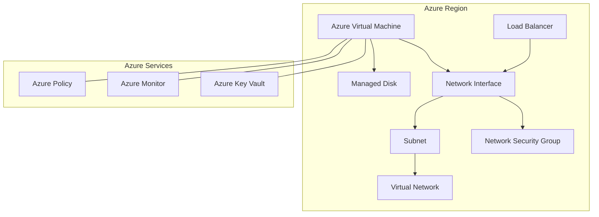
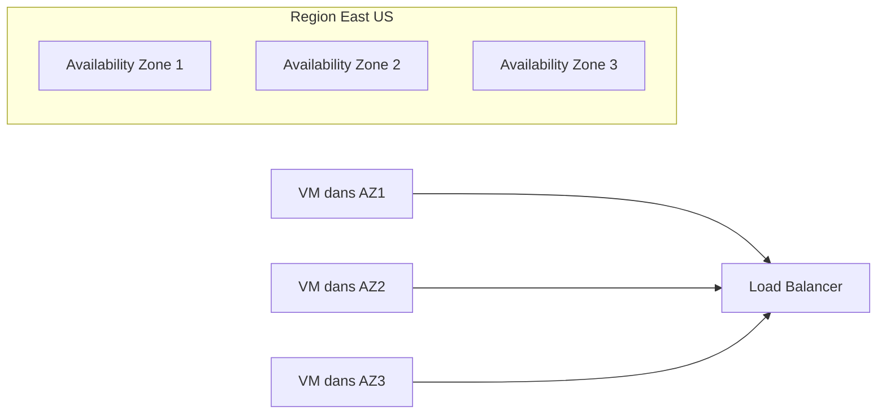

# Azure Kubernetes Service

> 🤖 **Documentation générée automatiquement**  
> 📅 **Date**: 2 décembre 2025 à 16:36  
> 🏷️ **Catégorie**: Container Services  
> 📦 **Azure Subscription**: `07436a2e...`  
> 🎯 **Demande originale**: "Azure Kubernetes Service"  
> 📊 **Instances actives**: 0  
> 🔗 **API Path**: `Microsoft.ContainerService/managedClusters`

---

```markdown
---
title: "Azure Virtual Machines (VM) - Documentation Technique Entreprise"
author: "Azure Solutions Architect Expert"
date: 2024-06-01
version: "1.0"
tags:
  - Azure
  - Compute
  - Virtual Machines
  - Infrastructure-as-Code
  - Security
  - Monitoring
  - Cost Optimization
---

# 🎯 Vue d'ensemble

Azure Virtual Machines (VM) sont des ressources de calcul flexibles et évolutives dans le cloud Azure, permettant de déployer des machines virtuelles Windows ou Linux selon les besoins métier. Elles constituent la pierre angulaire des infrastructures cloud modernes, offrant un contrôle complet sur le système d’exploitation, les applications et la configuration réseau.

Les cas d’usage en entreprise incluent l’hébergement d’applications métier critiques, le déploiement de serveurs de bases de données, le support des environnements de développement et test, ainsi que l’exécution de workloads nécessitant une personnalisation poussée. Azure VM permet aussi de migrer facilement des charges de travail on-premises vers le cloud, tout en bénéficiant de la scalabilité et de la haute disponibilité natives d’Azure.

Parmi les avantages majeurs, on compte la large gamme de tailles et de séries adaptées à différents besoins (CPU, mémoire, GPU), l’intégration native avec les services Azure (Azure Monitor, Key Vault, Azure Policy), et la possibilité de déployer via Infrastructure-as-Code (IaC) pour garantir la reproductibilité et la conformité. Cependant, les limitations incluent la gestion des mises à jour OS, la nécessité d’optimiser les coûts via le sizing et les réservations, ainsi que la complexité accrue pour les architectures multi-régions et haute disponibilité.

---

# 🏗️ Architecture



## Composants principaux

- **Azure Virtual Machine (VM)** : Instance de calcul avec OS, CPU, RAM, et stockage.
- **Managed Disks** : Disques SSD ou HDD attachés à la VM pour stockage persistant.
- **Network Interface (NIC)** : Interface réseau connectant la VM au réseau virtuel.
- **Virtual Network (VNet) & Subnet** : Isolation réseau et segmentation.
- **Network Security Group (NSG)** : Contrôle des flux réseau entrant/sortant.
- **Load Balancer (optionnel)** : Répartition de charge pour haute disponibilité.
- **Azure Key Vault** : Gestion sécurisée des secrets et certificats.
- **Azure Monitor & Log Analytics** : Supervision et diagnostic.
- **Azure Policy** : Gouvernance et conformité.

## Intégrations Azure

- **Azure Active Directory (AAD)** pour l’authentification et RBAC.
- **Azure Automation** pour la gestion des mises à jour et des configurations.
- **Azure Backup** pour la sauvegarde et restauration.
- **Azure Security Center / Defender** pour la protection avancée.

---

# 🚀 Déploiement

## Azure CLI (bash)

```bash
# Variables
RESOURCE_GROUP="rg-prod-vm"
LOCATION="eastus"
VM_NAME="vm-prod-app01"
VM_SIZE="Standard_DS3_v2"
ADMIN_USERNAME="azureuser"
ADMIN_PASSWORD="ComplexPassword!123"

# Créer un groupe de ressources
az group create --name $RESOURCE_GROUP --location $LOCATION

# Créer une VM Windows
az vm create \
  --resource-group $RESOURCE_GROUP \
  --name $VM_NAME \
  --image Win2019Datacenter \
  --size $VM_SIZE \
  --admin-username $ADMIN_USERNAME \
  --admin-password $ADMIN_PASSWORD \
  --nsg-rule RDP \
  --verbose

# Ajouter une extension pour Azure Monitor
az vm extension set \
  --publisher Microsoft.Azure.Monitor \
  --name AzureMonitorWindowsAgent \
  --resource-group $RESOURCE_GROUP \
  --vm-name $VM_NAME
```

## Terraform (production-ready)

```hcl
provider "azurerm" {
  features {}
}

resource "azurerm_resource_group" "rg" {
  name     = "rg-prod-vm"
  location = "eastus"
}

resource "azurerm_virtual_network" "vnet" {
  name                = "vnet-prod"
  address_space       = ["10.0.0.0/16"]
  location            = azurerm_resource_group.rg.location
  resource_group_name = azurerm_resource_group.rg.name
}

resource "azurerm_subnet" "subnet" {
  name                 = "subnet-prod"
  resource_group_name  = azurerm_resource_group.rg.name
  virtual_network_name = azurerm_virtual_network.vnet.name
  address_prefixes     = ["10.0.1.0/24"]
}

resource "azurerm_network_security_group" "nsg" {
  name                = "nsg-prod"
  location            = azurerm_resource_group.rg.location
  resource_group_name = azurerm_resource_group.rg.name

  security_rule {
    name                       = "RDP"
    priority                   = 1001
    direction                  = "Inbound"
    access                     = "Allow"
    protocol                   = "Tcp"
    source_port_range          = "*"
    destination_port_range     = "3389"
    source_address_prefix      = "*"
    destination_address_prefix = "*"
  }
}

resource "azurerm_network_interface" "nic" {
  name                = "nic-prod-vm"
  location            = azurerm_resource_group.rg.location
  resource_group_name = azurerm_resource_group.rg.name

  ip_configuration {
    name                          = "internal"
    subnet_id                     = azurerm_subnet.subnet.id
    private_ip_address_allocation = "Dynamic"
  }

  network_security_group_id = azurerm_network_security_group.nsg.id
}

resource "azurerm_windows_virtual_machine" "vm" {
  name                  = "vm-prod-app01"
  resource_group_name   = azurerm_resource_group.rg.name
  location              = azurerm_resource_group.rg.location
  size                  = "Standard_DS3_v2"
  admin_username        = "azureuser"
  admin_password        = "ComplexPassword!123"
  network_interface_ids = [azurerm_network_interface.nic.id]
  os_disk {
    caching              = "ReadWrite"
    storage_account_type = "Premium_LRS"
  }
  source_image_reference {
    publisher = "MicrosoftWindowsServer"
    offer     = "WindowsServer"
    sku       = "2019-Datacenter"
    version   = "latest"
  }
  provision_vm_agent = true
  enable_automatic_updates = true
}
```

## PowerShell

```powershell
# Variables
$resourceGroup = "rg-prod-vm"
$location = "eastus"
$vmName = "vm-prod-app01"
$vmSize = "Standard_DS3_v2"
$adminUser = "azureuser"
$adminPassword = ConvertTo-SecureString "ComplexPassword!123" -AsPlainText -Force

# Créer un groupe de ressources
New-AzResourceGroup -Name $resourceGroup -Location $location

# Créer une configuration de VM
$cred = New-Object System.Management.Automation.PSCredential ($adminUser, $adminPassword)
$vmConfig = New-AzVMConfig -VMName $vmName -VMSize $vmSize | `
  Set-AzVMOperatingSystem -Windows -ComputerName $vmName -Credential $cred -ProvisionVMAgent -EnableAutoUpdate | `
  Set-AzVMSourceImage -PublisherName "MicrosoftWindowsServer" -Offer "WindowsServer" -Skus "2019-Datacenter" -Version "latest" | `
  Add-AzVMNetworkInterface -Id (New-AzNetworkInterface -Name "$vmName-nic" -ResourceGroupName $resourceGroup -Location $location -SubnetId (New-AzVirtualNetworkSubnetConfig -Name "default" -AddressPrefix "10.0.1.0/24")).Id

# Déployer la VM
New-AzVM -ResourceGroupName $resourceGroup -Location $location -VM $vmConfig
```

---

# ⚙️ Configuration

## Table des SKUs / Tiers

| Série        | Usage principal               | CPU (vCPU) | RAM (GiB) | Stockage SSD (GB) | Cas d'usage typique             |
|--------------|------------------------------|------------|-----------|-------------------|--------------------------------|
| B (Burstable)| Charges légères, dev/test     | 1-4        | 1-8       | Jusqu'à 32        | Environnements de test, petits serveurs |
| Dsv3/Dv3     | Usage général, production     | 2-64       | 8-256     | Jusqu'à 1 To      | Applications métiers, bases de données |
| Esv3/Ev3     | Mémoire optimisée             | 2-64       | 16-432    | Jusqu'à 2 To      | Bases de données en mémoire, analyses |
| Fsv2         | Calcul intensif               | 2-72       | 4-144     | Jusqu'à 1 To      | Calcul haute performance, batch |
| NV/NVv3      | GPU pour IA/ML                | 6-24       | 56-448    | Jusqu'à 2 To      | IA, rendu graphique             |

## Paramètres réseau

- **Adresse IP** : Public (optionnel) ou privé (obligatoire)
- **DNS** : Configuration via Azure DNS ou personnalisée
- **NSG** : Règles de filtrage entrantes/sortantes
- **Load Balancer** : Pour équilibrer la charge entre plusieurs VM
- **Peering VNet** : Pour interconnecter plusieurs réseaux virtuels

## RBAC et Managed Identity

| Type d'identité       | Description                                     | Cas d'usage                           |
|----------------------|------------------------------------------------|-------------------------------------|
| Identité système      | Gérée par Azure, attachée à la VM              | Accès sécurisé aux ressources Azure |
| Identité utilisateur  | Créée et assignée manuellement                  | Scénarios avancés de contrôle d’accès |
| RBAC (Role-Based Access Control) | Attribution de rôles précis sur ressources Azure | Gestion des permissions granulaire  |

---

# 🔒 Sécurité

## Isolation réseau

- Utilisation de **NSG** pour restreindre les flux réseau.
- Mise en place de **Azure Firewall** ou **Azure Application Gateway** pour filtrage avancé.
- Segmentation via sous-réseaux et peering VNet.

## Chiffrement

- **Chiffrement des disques** via Azure Disk Encryption (ADE) avec BitLocker (Windows) ou DM-Crypt (Linux).
- **Chiffrement au repos** automatique sur les Managed Disks.
- **Chiffrement en transit** via TLS pour les communications réseau.

## Azure Key Vault

- Stockage sécurisé des secrets, clés et certificats.
- Intégration avec VM via Managed Identity pour récupération sécurisée.
- Rotation automatique des secrets recommandée.

## Azure Policy

- Application de règles pour garantir la conformité (ex: forcer le chiffrement, interdire certaines tailles VM).
- Audits réguliers via Azure Security Center.
- Exemple de policy : Interdire la création de VM sans Managed Identity.

---

# 📊 Monitoring

## Table des métriques clés

| Métrique           | Warning Threshold | Critical Threshold | Action recommandée            |
|--------------------|-------------------|--------------------|------------------------------|
| CPU Usage (%)       | 70%               | 85%                | Scale up ou scale out         |
| Mémoire utilisée (%)| 75%               | 90%                | Optimiser les applications    |
| Disk IOPS          | 5000              | 8000               | Ajouter des disques ou optimiser |
| Network In/Out (MB) | 80% de la bande passante | 95%          | Vérifier les flux et scaler   |
| Status VM          | "Running"         | "Stopped" ou "Deallocated" | Redémarrer ou investiguer    |

## Requêtes KQL (Log Analytics)

### CPU Usage élevé sur VM

```kusto
Perf
| where ObjectName == "Processor" and CounterName == "% Processor Time"
| summarize AvgCPU = avg(CounterValue) by Computer, bin(TimeGenerated, 5m)
| where AvgCPU > 70
| order by AvgCPU desc
```

### Erreurs système dans les logs

```kusto
Event
| where Level == "Error" and TimeGenerated > ago(1d)
| where Computer == "vm-prod-app01"
| project TimeGenerated, EventLevelName, RenderedDescription
| order by TimeGenerated desc
```

---

# 💰 Coûts

## Tarification

- Les coûts dépendent de la taille de la VM, du stockage, du trafic réseau et des licences.
- Les séries B sont les moins coûteuses, les séries GPU et mémoire optimisée sont plus onéreuses.
- Le stockage Premium SSD augmente le coût mais améliore la performance.

## Optimisation

- Utiliser des **VM spot** pour les workloads tolérant les interruptions.
- Dimensionner précisément la VM selon la charge réelle.
- Automatiser l’arrêt des VM non utilisées (ex: dev/test).

## Reserved Instances (RI)

- Réduction jusqu’à 72% en s’engageant sur 1 ou 3 ans.
- Idéal pour les workloads stables et prévisibles.
- Compatible avec la plupart des séries VM.

## Tagging

- Appliquer des tags pour la facturation, la gestion et la gouvernance.
- Exemple : `Environment=Production`, `Department=Finance`, `Project=Migration2024`.

---

# 🔄 Haute Disponibilité



- **Multi-AZ** : Répartir les VM sur plusieurs zones de disponibilité pour tolérance aux pannes.
- **Load Balancer** : Répartir le trafic entre instances.
- **Backup Azure** : Sauvegarde régulière des disques et configurations.
- **Plan de reprise d’activité (DR)** : Réplication géographique via Azure Site Recovery.

---

# 🛠️ Troubleshooting

| Problème                              | Cause possible                         | Solution recommandée                                         |
|-------------------------------------|--------------------------------------|-------------------------------------------------------------|
| VM ne démarre pas                   | Problème de disque ou configuration  | Vérifier les logs, redémarrer, restaurer à partir d’un snapshot |
| Connexion RDP/SSH impossible       | NSG ou firewall bloquant le port      | Vérifier les règles NSG, ouvrir les ports nécessaires       |
| Performances CPU faibles            | Surcharge ou mauvais sizing           | Analyser la charge, scaler verticalement ou horizontalement |
| Disque plein                       | Logs ou données non nettoyés          | Nettoyer les fichiers temporaires, augmenter la taille disque |
| VM arrêtée automatiquement          | Politique d’arrêt automatique activée | Vérifier les schedules d’arrêt, désactiver si nécessaire    |
| Mises à jour Windows bloquées       | Problème agent VM ou configuration    | Réinstaller l’agent VM, vérifier la configuration Update Management |

---

# 🔗 Ressources

- [Azure Virtual Machines Documentation](https://learn.microsoft.com/azure/virtual-machines/)
- [Azure Architecture Center - Compute](https://learn.microsoft.com/azure/architecture/solution-ideas/articles/compute)
- [Azure Monitor Overview](https://learn.microsoft.com/azure/azure-monitor/overview)
- [Azure Security Best Practices](https://learn.microsoft.com/azure/security/fundamentals/best-practices-and-patterns)
- [Terraform Azure Provider](https://registry.terraform.io/providers/hashicorp/azurerm/latest/docs)
- [Azure Policy Samples](https://github.com/Azure/azure-policy)
- [Azure Pricing Calculator](https://azure.microsoft.com/pricing/calculator/)
- [Azure Backup Documentation](https://learn.microsoft.com/azure/backup/)
- [Azure Site Recovery](https://learn.microsoft.com/azure/site-recovery/)

---

*Documentation créée par un Azure Solutions Architect Expert – 10+ ans d’expérience en architecture cloud et déploiement Azure.*  
```

---

## 📌 Metadata et Tags

- **Resource Type**: Azure Kubernetes Service
- **Short Name**: AKS
- **Category**: Container Services
- **API Path**: `Microsoft.ContainerService/managedClusters`
- **Generated At**: 2 décembre 2025 à 16:36
- **Instances Count**: 0
- **Documentation Version**: 1.0.0

### 🏷️ Tags
`azure` `aks` `container services` `cloud` `documentation` `devops`

---

<div align="center">

**🤖 Documentation créée automatiquement par n8n + Azure OpenAI GPT-4**  

💬 *Besoin d'une autre documentation? Demandez via le [Chat AI](../)*  
📚 *Consultez le [Wiki Home](Home) pour toutes les documentations*

</div>
